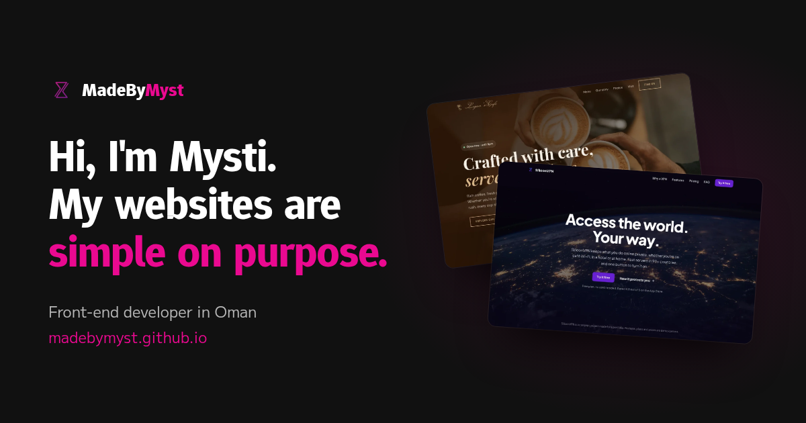

<div align="center">


# MadeByMyst

### Websites, simple on purpose.

[](https://madebymyst.github.io)

</div>



The portfolio of **Mysti**, a self-taught front-end developer in Oman who builds landing pages and business websites for small businesses and new products, in plain HTML, CSS and JavaScript.

## Why simple?

Most people decide in a few seconds whether to stay on a website. So I keep things simple on purpose:

- **Clear.** Visitors understand what you do and what to click next, without hunting for it.
- **Fast.** No frameworks or heavy add-ons, so pages stay light even on a slow connection.
- **Easy to change.** Plain HTML, CSS and JavaScript that any developer can read and update.

## What I build

| | |
|---|---|
| **Landing pages** | One page with one job: explain your product or offer, then get people to sign up, book or get in touch. |
| **Business websites** | A few well-organised pages that show what you do and make it easy for people to reach you. |

Every site works on phones, tablets and desktops, loads fast, comes with revisions, and is handed over as clean, commented code.

## Work

| Project | Type | Links |
|---|---|---|
| **SiliconVPN** | Landing page, concept brand | [Live](https://madebymyst.github.io/silicon-vpn/) · [Code](https://github.com/MadeByMyst/silicon-vpn) |
| **Logan'sCafe** | Business website, concept brand | [Live](https://madebymyst.github.io/logans-cafe/) · [Code](https://github.com/MadeByMyst/logans-cafe) |
| **Logan'sCafe Dashboard** | Owner dashboard, concept brand | [Live](https://madebymyst.github.io/logans-cafe-dashboard/) · [Code](https://github.com/MadeByMyst/logans-cafe-dashboard) |
| **MadeByMyst** | Portfolio, this repo | [Live](https://madebymyst.github.io/) |

## How this site is built

| File | What it does |
|---|---|
| `index.html` | The page, one section per part of the story |
| `styles.css` | Design tokens at the top, then each section, written mobile-first |
| `script.js` | Mobile menu, scroll effects, the FAQ animation and the contact form. The page works without it. |

No frameworks, no build step. The only outside services are Google Fonts (Epunda Sans and M PLUS 2) and [FormSubmit](https://formsubmit.co) for the contact form.

To run it locally, open `index.html` in a browser, or serve the folder:

```bash
python3 -m http.server
```

## Work with me

<div align="center">

[](https://www.fiverr.com/s/DBbLZDo)
[](https://www.upwork.com/freelancers/~01f1c8b9c3e2a7b9e5)
[](https://www.freelancer.com/u/mystiqdev)
[](https://www.instagram.com/_mystiqdev72/)

📧 mystique20084589@gmail.com

*© 2026 MadeByMyst (Shahab MD). Based in Oman.*

</div>
